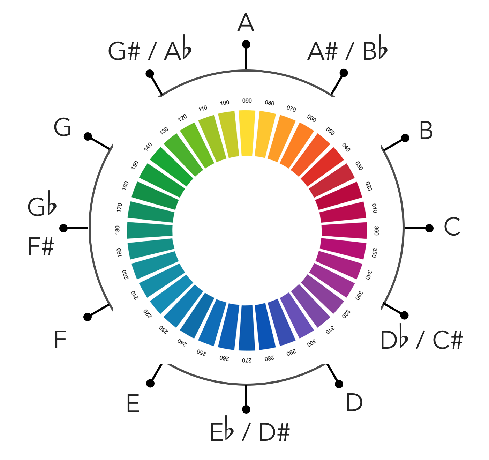

# *MIDI's not dead!*
## (And other musical ways to use JS)

---

# Who are you anyways?

* Dev 🥑 @ Cloudflare
* IoT author (JS on hardware)
* Self-taught EE major
* Budding musician

---

# *Building a JS Band*

---

# 1. The *bass*
## A lesson in MIDI, music theory, and project complexity

---

# What I Wanted

I wanted my bass to light up in a way that had something to do with what was being played.

---

---

# What it is

* Lights up rainbow when silent
* Uses hue/note wheel to light up the color of the note being played

---

# What it Looks Like

[image]

---

# How it Works

1. Analog sound comes out of the bass and into an A/B/Y switch
1. One fork goes to Sonuus MIDI converter
1. Sonuus data goes into Node script that determines hue of note
1. Node script tells Fadecandy what color to set the lights

---

# How the Software Works

* `npm install midi tonal color`
* Install fadecandy server (`fcserver`)
* `midi` takes the MIDI data from converter, `tonal` tells me what note
* use `color` and HSV algorithm to get the hue
* Send OBS data to `fcserver` to light it up

---

## Short Demonstration

---

# Still some limitations

* Sonuus converter is monotone (no chords)
* Electrical noise is a thing!
* I'm no professional bassist!

---

# The *Messaging System*
## Because bandmates have to talk to each other

---

# My Communications System

* Node WebSocket server
* Receives & broadcasts messages to/from instruments
* I named it Maestro

---

# What it Looks Like

[image]

---

# How it Works

* Takes in messages from connected clients (instruments)
* Broadcasts messages to clients

---

# The *Controller*
## Because typing and playing bass don't mix

---

# What it is

* Ableton Launchpad MK2
* LOTS of buttons
* RGB LEDs
* plays MP3s on queue
* sends messages to the communications system

---

# What it Looks Like

[image]

---

# How it Works

* Fork of the Ableton-MK2 library for button events/lighting
* node-mp3-player for MP3 sounds
* ws to connect to Maestro and send events

---

# The *Melody/Drum Player*
### Because a bass does not a band make

---

# What it is

* Tone.JS running in a browser
* Websocket connection to Maestro
* GIFs
* Plays the melody and drum parts (with a cue)

---

# Let's Play a Song

---

# What That Looked Like

[image[

---

# How that worked

* Pressing a button on the controller sent 'PlaySong' to Maestro
* Maestro broadcasted 'StartSong'
* All instruments now know the song is cued
* Melody player started cue, followed by song
* I played along
* MIDI detection on the Pi + Fadecandy

